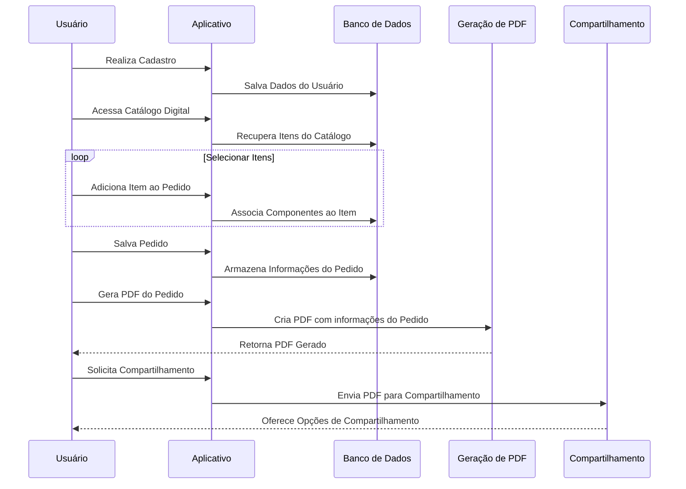

### Diagrama de Sequência - Uso do Aplicativo
Esse diagrama de sequência representa visualmente o fluxo de interações entre o usuário e o sistema durante o uso do aplicativo para realizar um pedido no catálogo de materiais.

#### Descrição Detalhada:

1. **Cadastro do Usuário:**
   - O usuário realiza o cadastro no aplicativo.
   - O aplicativo salva os dados do usuário no banco de dados.

2. **Acesso ao Catálogo Digital:**
   - O usuário acessa o catálogo digital disponibilizado pelo aplicativo.
   - O aplicativo recupera os itens disponíveis no catálogo do banco de dados.

3. **Seleção de Itens e Adição ao Pedido:**
   - O usuário adiciona itens desejados ao seu pedido.
   - O aplicativo associa os componentes necessários a cada item selecionado, buscando essas informações no banco de dados.

4. **Salvar Pedido:**
   - Após selecionar todos os itens desejados, o usuário salva o pedido no sistema.
   - O aplicativo armazena as informações do pedido no banco de dados.

5. **Geração do PDF do Pedido:**
   - O usuário solicita a geração do PDF para o pedido finalizado.
   - O aplicativo cria um PDF contendo as informações do pedido.
   - O PDF gerado é disponibilizado para o usuário.

6. **Compartilhamento do PDF:**
    - Após receber o PDF gerado, o usuário solicita o compartilhamento do documento.
    - O aplicativo envia o PDF para o serviço de compartilhamento.
    - O serviço de compartilhamento oferece opções para o usuário compartilhar o PDF (por e-mail, mensagem, armazenamento na nuvem, etc.).