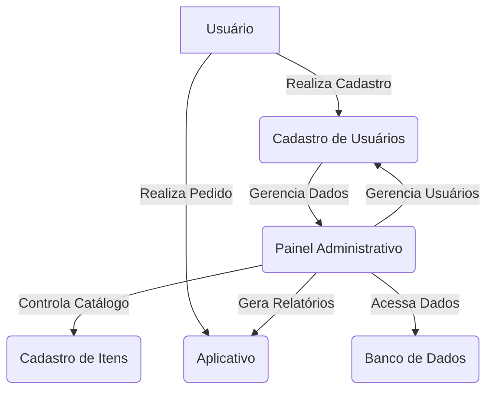
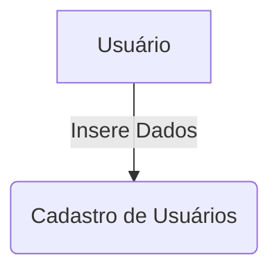
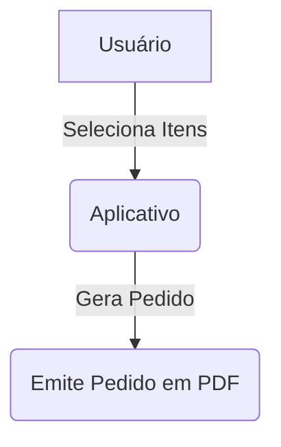
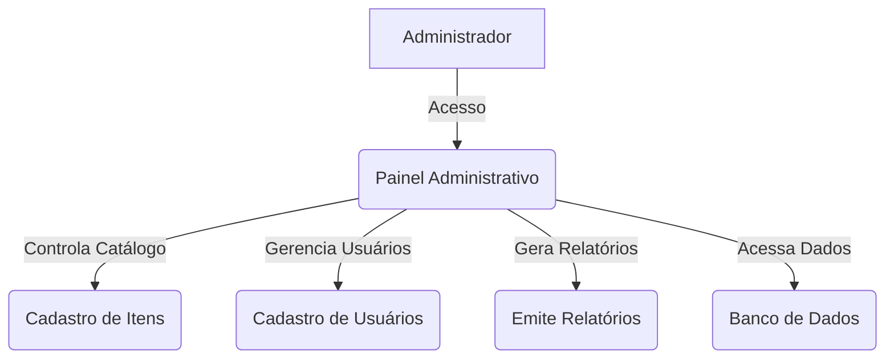
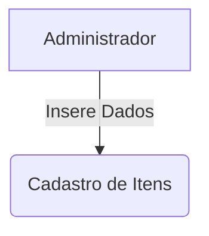
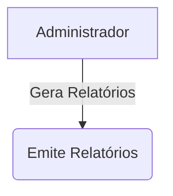
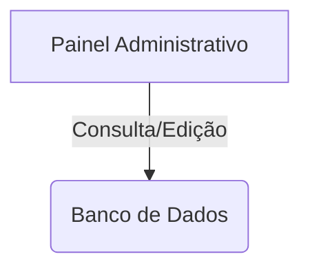

### Diagrama de Casos de Uso

  
# Casos de Uso Detalhados

### Diagrama de Caso de Uso - Cadastro de Usuários

#### Descrição Detalhada:
- **Ator Principal:** Usuário
- **Descrição:** O usuário insere dados pessoais no formulário de cadastro. Esses dados são processados e salvos no sistema.

### Diagrama de Caso de Uso - Realiza Pedido

#### Descrição Detalhada:
- **Ator Principal:** Usuário
- **Descrição:** O usuário utiliza o aplicativo para selecionar os itens desejados. Após a seleção, o sistema gera um pedido em PDF contendo informações de identificação da empresa requerente, do fornecedor e a lista de itens com códigos e quantidades.

### Diagrama de Caso de Uso - Gerência de Dados

#### Descrição Detalhada:
- **Ator Principal:** Administrador do Sistema
- **Descrição:** O administrador acessa o Painel Administrativo para controlar o catálogo de itens, gerenciar usuários, gerar relatórios e acessar informações no banco de dados.

### Diagrama de Caso de Uso - Cadastro de Itens

#### Descrição Detalhada:
- **Ator Principal:** Administrador do Sistema
- **Descrição:** O administrador insere dados dos itens no sistema, incluindo descrição, imagem, código, entre outros campos, para compor o catálogo de materiais.

### Diagrama de Caso de Uso - Geração de Relatórios

#### Descrição Detalhada:
- **Ator Principal:** Administrador do Sistema
- **Descrição:** O administrador, por meio do Painel Administrativo, gera relatórios com informações relevantes do sistema, como pedidos realizados, usuários cadastrados, entre outros dados.

### Diagrama de Caso de Uso - Acesso a Dados

#### Descrição Detalhada:
- **Ator Principal:** Painel Administrativo
- **Descrição:** Através do Painel Administrativo, é possível consultar e editar informações armazenadas no Banco de Dados para manter a integridade e a segurança dos dados do sistema.